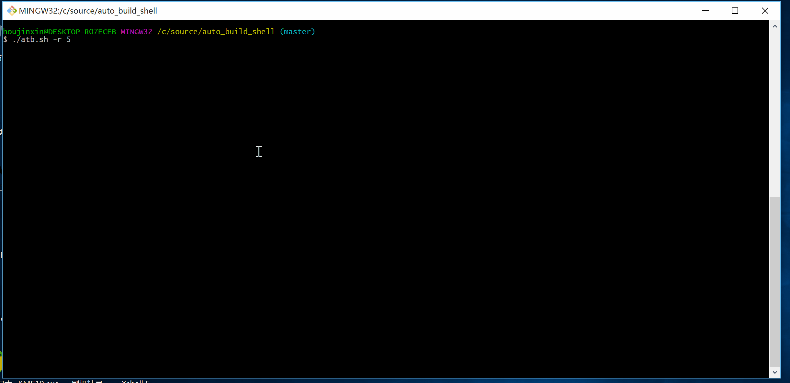

# 轻量级持续集成工具 -- 简单配置 一键发布
## ATB交流QQ群：== [326363033](https://shang.qq.com/wpa/qunwpa?idkey=04c38c2f3d6aebca1930ddd5f3ccf9a5581bc0e4fffd6ea156c1cebe9e4b3716) ==

## 简介
在开发中我们需要频繁的调整代码并发布到各种环境去测试。通常我们会花费比部署代码要多的多的时间去进入和退出各个目录、执行启动脚本、查看启动日志。当你做完这些事情你可能忘了你只是为了看看代码执行的效果。为了避免这种情况而把更多的精力放到代码测试上，借鉴Jenkins的思想，写了这么个工具。它具有以下功能：
* 自动从版本管理工具如svn、git等下载代码
* 自动用工程构建工具如maven、gradle等打包工程
* 自动上传包到远程和本地服务器（远程服务器需要账号和密码）
* 支持远程多机发布
* 自动重启远程或本地服务器
* 自动查看启动日志
* 支持windows（依赖Git For Windows）、linux、mac系统
* 自动备份功能，默认路径为tomcat目录的backup，开关可控
* 查看服务器上备份历史
* 自动回滚到指定版本

你可以用它来发布代码到你自己的阿里云。在项目组内推广后备受好评，谁用谁知道。

`注意：本脚本默认认为发布程序到Tomcat的webapps下，若使用其他服务器请自行修改脚本中容器启动部分的代码`

## 前提条件
* 安装JDK并配置环境变量
* 安装maven
* 安装git或svn(windows下需安装[svn命令行工具](https://tortoisesvn.net/downloads.html))并配置到环境变量
* 安装tomcat到本地任意目录（本地发布）
* 配置ssh免密码登录（防止操作过程中频繁输入密码）

## 快速上手

1. 将atb.sh放到本机任意目录下，然后将该目录路径设置到环境变量中
2. 将conf.ini文件放到家目录下,即命令行执行`cd`所进入的目录
3. 修改conf.ini文件中的配置项，参考：[配置说明](docs/配置说明.md)
4. 将restart.sh放到服务器上指定目录，如：`/home/product`，在conf.ini中修改`config_remote_shell_dir=/home/product`
5. 具体用法见下面帮助

```
 usage: atb [Options]

     Options：
      -c                                        clean 工程
      -du [ -l ]                                直接上传已存在war包到本地服务器
      -du -r <server_flag>                      直接上传已存在war包到指定的远程服务器
      -h                                        帮助
      -l                                        自动编译打包本地部署
      -r <server_flag>                          自动编译打包远程部署到指定的远程服务器
      -his -r <server_flag>                     查看指定的远程服务器上备份详情"
      -r <server_flag> -rb <backup_version>     回滚当前版本到backup_version指定的版本"

```

```
    Options说明
     c                       -- clean           来自mvn clean
     du                      -- direct upload   已有war包，直接上传；没有war包，重新打包上传 
     h                       -- help            帮助
     l                       -- local           本地
     r                       -- remote          远程
     his                     -- history         备份历史
     server_flag             -- 服务器标识        用于标识上传到哪一台远程服务器
     rb                      -- rollback        回滚命令
     backup_version          -- 备份版本号        与rb配合使用 用于指定回滚到的版本

```

## 示例
```
    `atb.sh -du -r` war包已存在的情况下直接发布war包到远程服务器，不存在重新打包再发布
    `atb.sh` 本地发布 等同于 `atb.sh -l`
    `atb.sh -r 244` 如果你的remote_server_flags中包含244 那么就会发布到244所代表的机器上
    `atb.sh -his -r 244` 查看244上备份历史
    `atb.sh -r 244 -rb maiev_20170415211120` 244机器上回滚当前版本到2017-04-15 21:11:20的版本

```

## 动图演示


## 支持的操作系统
* windows 
	使用[Git for windows](https://git-for-windows.github.io/)的Git Bash执行脚本
* linux
* mac

## CHANGELOG
### v1.0.1
* 重新定义了配置文件，使用ini格式的配置文件，并将要配置的属性分类处理
* 修复远程多机部署BUG,在配置文件remote-server节点下修改各属性，不同机器配置用英文逗号或空格隔开
* 规范日志输出
* 修改README.md，配置说明单独放到一个文件
* [更多](CHANGELOG.md)

## 我的联系方式
* Email: woshihoujinxin@163.com
* QQ: 574311651
* 微信：h574311651

## TODO事项
* 增加通过配置指定最多保存的备份数功能
* 考虑怎么让配置更加灵活，不局限于maven的工程结构
* 考虑对Mysql数据库升级与回退的支持 

## 需求征集
如果你们有任何好的想法和需求都可以告诉我，我来完善。
